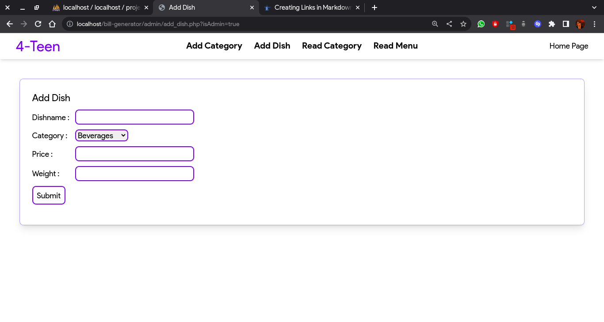

# Restaurant Mangement System 🍜🍜

```
From : Het Jasani
(who sorts of hates PHP 🤫 🤫 🤫)
```

- This is a restaurant mangement  system with a bill generator that generates bills in PDF format build using PHP and MySQL.
- This is a very basic project to demonstrate the crud functionality in PHP and MySQL 
- One can use the code freely there is no kind of copyright or restriction in the repository
- Contributors are eagerly invited to the issue section 
- Step by step installation guide is provided below 
- For any query email me at **hetekta2709@gmail.com** or **sintheteisnotvalid@gmail.com**


# Some snapshots of the system


---

### Admin Panel





---

### Bill Generator


---

# Installation Guide 

1. First of all I spend more than 3 weeks coding this thing so please star this repository so that I can impress my crush  😁

2. Anyways thanks for a star, now first of clone this repository of download the zip and if you dont know how to download the zip oh my gosh, you gotta learn this shit soon 😤 

  

3. Extract the folder and place it inside the `htdocs` folder inside `xampp` directory

4. You will file file with `.sql` extension called the `projects.sql` copy the contents

5. Goto `localhost/phpmyadmin` and create a database called `projects`


6. Go inside the database and then paste the clipboard content to the sql codespace


7. Click on go 


## You are good to go  
### If for any reason the project is not running as it should then it's the issue of PHP not mine....🤬

# Thanks for reading till here and please don't forget to drop a star 😁
